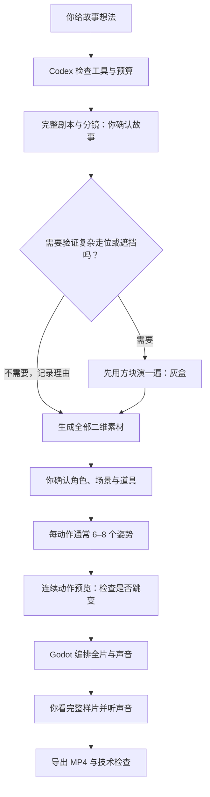

# 用 AI 制作完整 2D 剧情

`2d-pipeline 0.1.0` · Codex Skill · 公开预览版

把一个故事想法，组织成 **剧本 → 二维素材 → 动作姿势序列 → Godot 编排 → 声音 → MP4**。不需要建模、绑骨骼，也不是从视频抽帧。

[下载完整 Skill ZIP](https://github.com/bjdenghao-cn/codex-2d-pipeline/raw/refs/heads/main/2d-pipeline-v0.1.0.zip) · [小白使用说明](USAGE.md) · [验证报告](validation.md) · [已知问题](DELIVERY.md) · [反馈问题](https://github.com/bjdenghao-cn/codex-2d-pipeline/issues)


> 配图为 AI 辅助生成的教学示意，不是运行截图或成片证明。当前版本已通过本地技术测试，**真实在线生图、正式美术与完整剧情视听效果尚未验收**。请先用小项目试跑，不把它当作一键必成的软件。

## 第一次使用：只做这三件事

1. 下载上面的 ZIP 并解压，找到里面整个 **`2d-pipeline` 文件夹**。
2. Windows：将它放入 `C:\Users\你的用户名\.codex\skills\`。最终应看到 `2d-pipeline\SKILL.md`，不要只复制这一个文件。已有同名目录先备份。
3. 在 Codex 开启新任务，输入下面的话；若未识别 Skill，重启 Codex 再试。

```text
使用 $2d-pipeline 制作一段 15 秒、9:16 的完整 2D 剧情短片。
故事想法：一个送货员帮助小机器人越过断桥，最后一起送达包裹。
使用原创角色，明亮自然光，画面干净，细节和纹理克制。

先检查依赖和可用生图工具，告诉我缺什么、怎么安装。
你负责写完整剧本、分镜、全部素材清单，并判断是否需要灰盒。
动作直接从参考图生成每动作通常 6–8 个连续姿势，不建模、不绑骨、不抽视频帧。
由你完成 Godot 编排、声音和 MP4 导出，不让我手写配置或代码。
每一步只告诉我：做到哪、给我看什么、需要我确认什么、下一步是什么。
先确认故事，再确认角色与素材，再看动作和整段样片。
付费生成、重试、购买素材和公开发布都先征求我的同意。
```

这是启动指令，**不是 Skill 源码的替代品**。先安装完整文件夹，才能调用其中的脚本和规则。

## 需要的软件、插件和替代方案

| 准备项 | 用途 | 必需程度 / 替代方式 |
| --- | --- | --- |
| Codex + 本 Skill | 组织与执行流程 | 必需；Skill 不是独立应用 |
| Python + Pillow | 检查图片、整理姿势、执行脚本 | 必需；依赖见包内 requirements.txt |
| Godot 4 + 可用 GPU 图形环境 | 把二维素材编成完整故事 | 当前执行器必需；不要求 Godot MCP |
| FFmpeg + ffprobe | 封装 MP4、检查音画与解码 | 必需 |
| 已授权且真实可调用的生图工具 | 生成场景、角色、道具和动作姿势 | 可换成你提供的合法 PNG；不绑定某家商业插件 |
| 配音 / 音乐 / 音效来源 | 为故事配声音 | 按需；可用授权音频或明确选择静音 |

**不需要 Blender、建模插件或绑骨插件。** 不同生图工具的登录、费用和接口不同；让 Codex 检查你的实际工具，不要把“有生图账号”当成“已接通自动调用”。详细部署见 [使用说明](USAGE.md)。

## 自动流程里，你需要确认什么？



“6–8 个”指**一个动作的有序姿势数**，不是整片只有 6–8 张图，也不是每秒帧数。平移等不改变形状的动作可由 Godot 完成，无需反复生图。简单故事可以跳过灰盒，但需记录原因。

自动执行不等于无限授权。缺工具、缺素材、检查不通过、需要登录或付费时会暂停。用户无需手工切图或写 Godot 脚本；这些由 Codex 在实际项目中配置执行。

## 当前版本做到哪一步？

- 34 项测试通过，包含真实 Godot GPU 渲染、分阶段执行、审批失效和断点继续。
- 合成诊断素材：15 秒、1080×1920、30 fps、450 帧、H.264/AAC MP4 与完整解码通过。
- **未验证**：真实在线生图、真实角色一致性、正式动作接触质量、全片剧情观感与混音接受。
- 已知问题：外部步骤改写上游配置后失败，原始缓存可能短暂保留旧审批显示；再次运行 `status` 或 `run` 会刷新并撤销过期审批。失败后先查询状态，不依据旧缓存放行。

测试通过不等于所有故事都能自动完成，也不等于视觉质量合格。具体范围见 [验证报告](validation.md)。完整源码、脚本与测试包含在上方 ZIP 中。

## 下载校验与许可

文件：`2d-pipeline-v0.1.0.zip`

SHA-256：
```text
9C07507D4E5E080EABEA0505E6CE0761A670B6486A1883DAC287743E18EB025F
```

本仓库未附加开源许可证；公开可见不代表授予无限制再分发或商用许可。第三方工具、模型输出、字体、音乐和素材需分别遵守各自条款。不要上传密钥或未获授权的素材。
