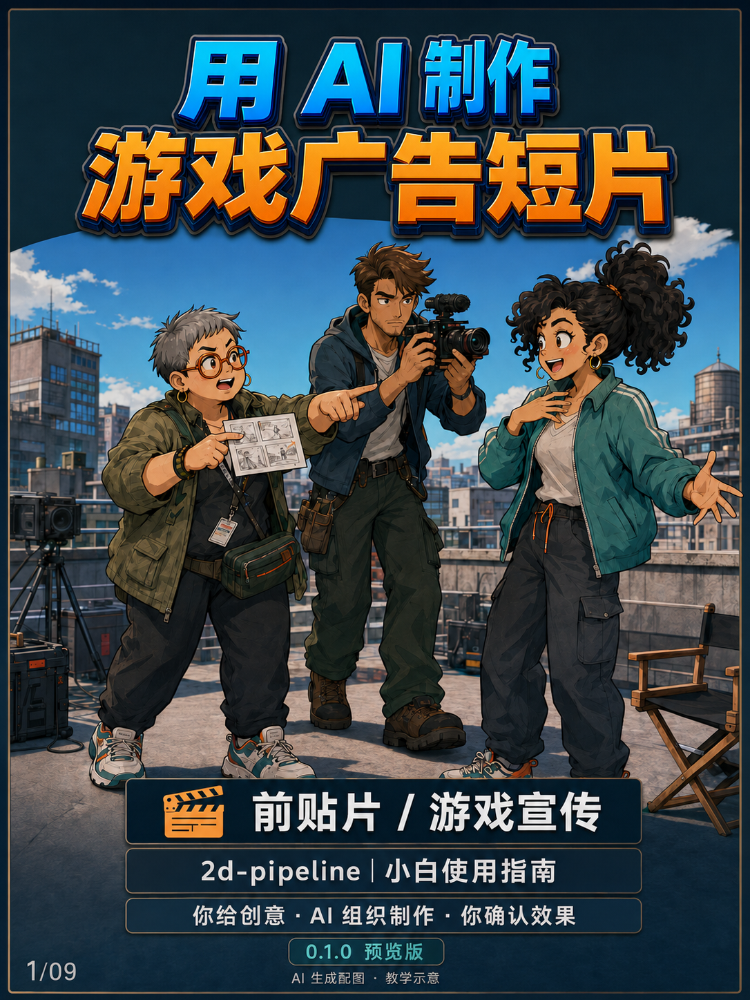
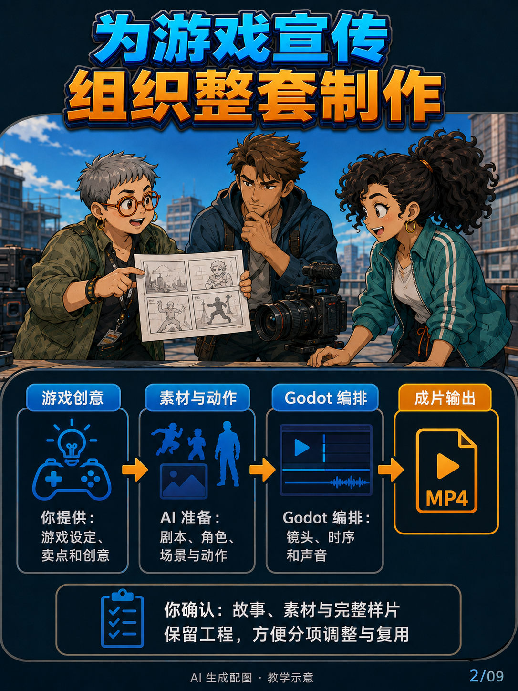
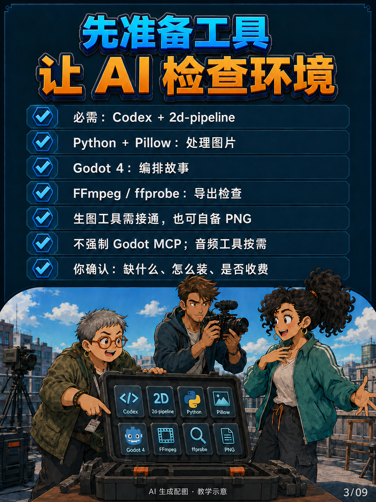
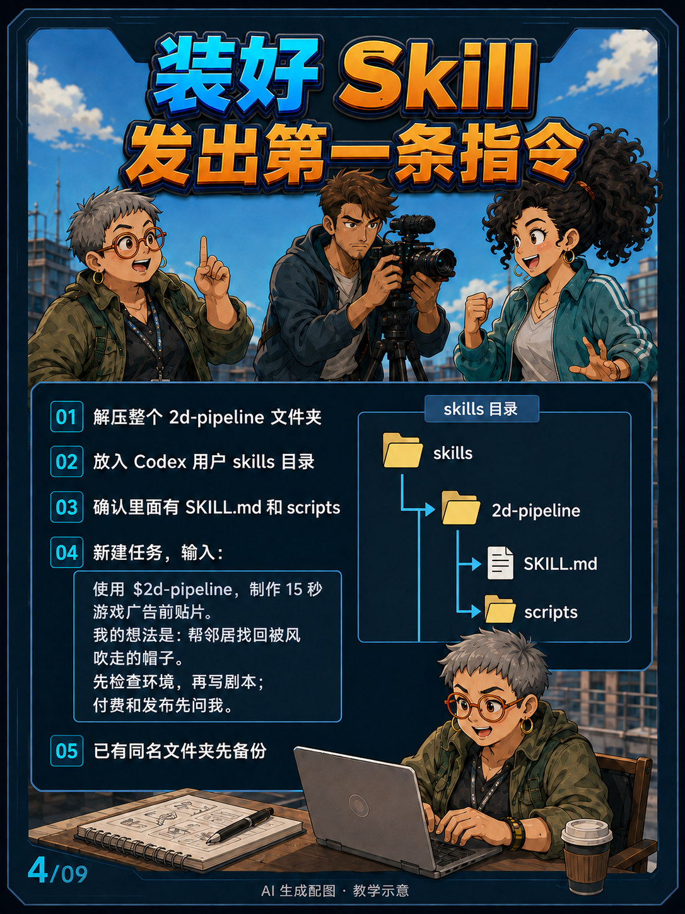
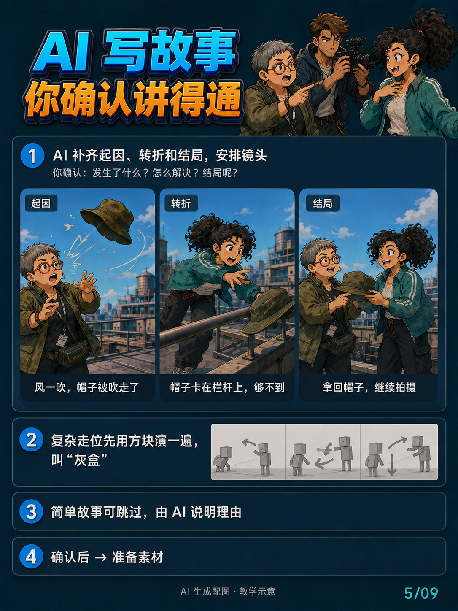
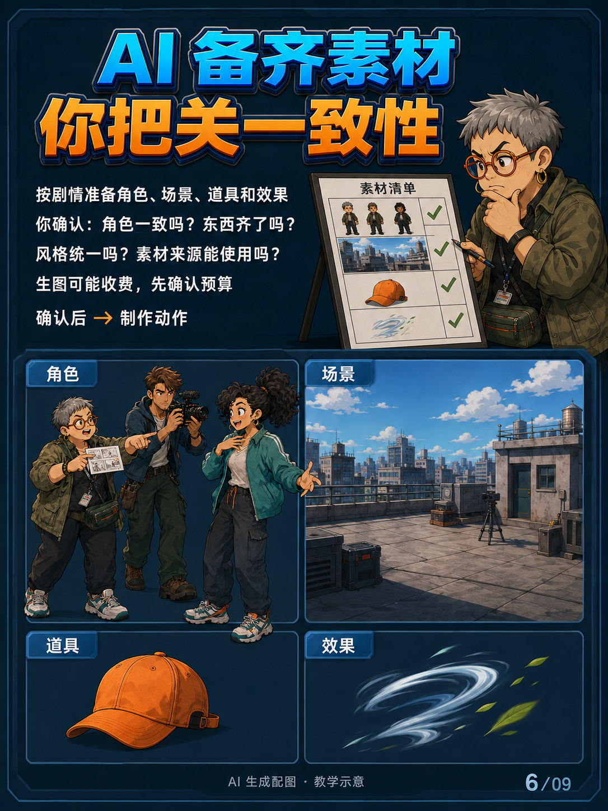
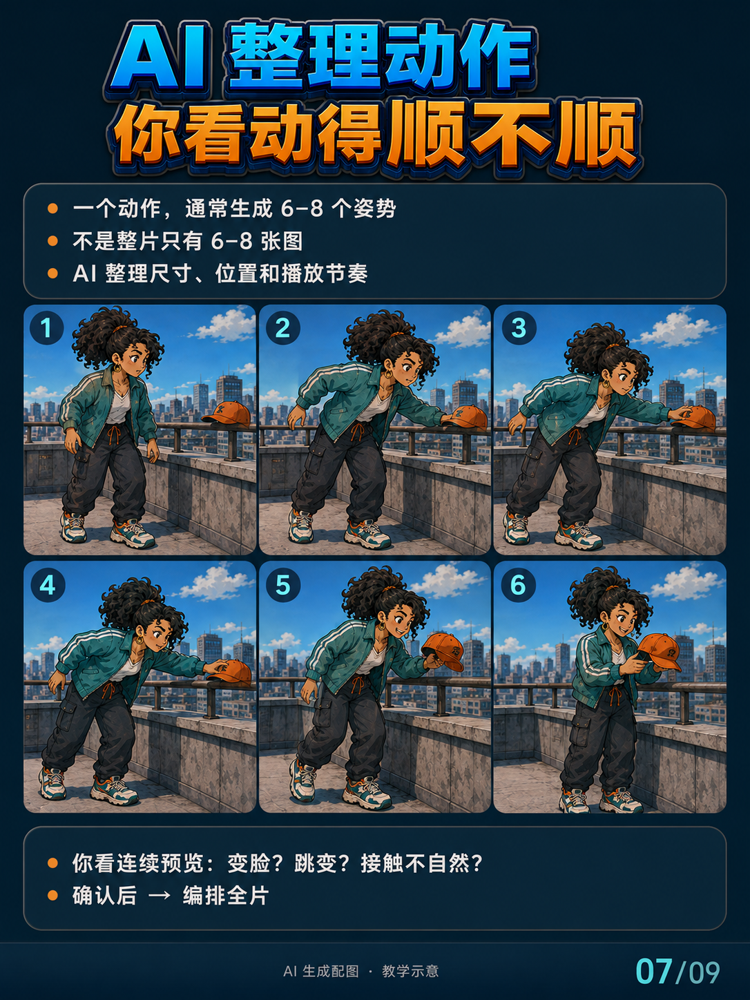
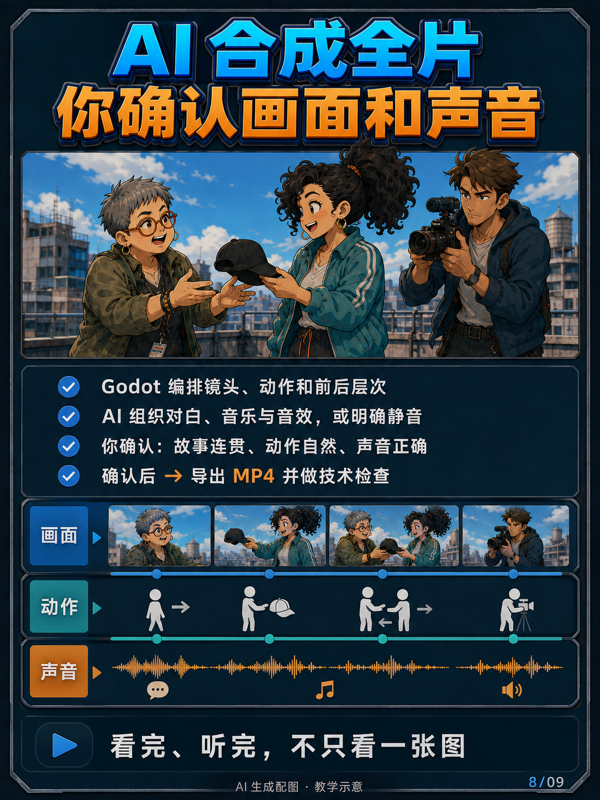
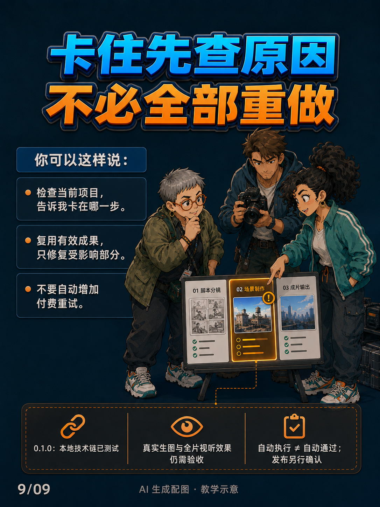

# 九图使用指南

本流程主要面向游戏广告前贴片与游戏宣传短片。你给游戏设定、卖点和创意，AI 组织制作，你在关键步骤确认效果。以下配图均为 AI 生成教学示意，不是执行器运行截图、已生成的正式素材或成片证明。

完整部署和可复制指令见 [使用说明](USAGE.md) 与 [首页](README.md)。当前为 0.1.0 预览版，已验证能力和未验证范围见 [验证报告](validation.md)。

## 01｜用途与核心分工

## 02｜你决定，AI 组织

## 03｜准备工具

## 04｜安装与启动

Windows 默认技能目录：`C:\Users\你的用户名\.codex\skills\`。放入整个 `2d-pipeline` 文件夹，不要只复制 SKILL.md，也不要多套一层目录。

## 05｜确认故事

## 06｜确认素材

## 07｜审看动作

## 08｜看完整样片

## 09｜出错后继续

外部步骤失败后先运行状态检查，不能以原始缓存中的旧审批作判断。技术检查通过、视觉接受、声音接受和发布授权是不同事项。
